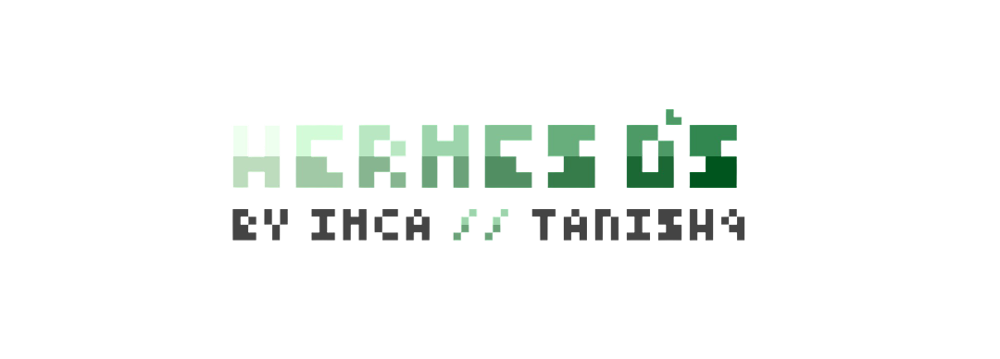

<div align="center">

# HERMES: A Desktop Environment, Reimagined as a Web App

*Not a website pretending to be an OS but an OS that happens to run in one.*

</div>

> [!CAUTION]
> PROPRIETARY AND CONFIDENTIAL
> This project, along with the associated codebase, constitutes the proprietary and strictly confidential intellectual property of its author.
> UNAUTHORIZED USE IS STRICTLY PROHIBITED. You may not copy, distribute, transmit, reproduce, publish, modify, or create derivative works from this source material without explicit, documented authorization from the chief developer.
> This repository does NOT grant an open-source license. All rights are explicitly reserved.

<p align="center">


</p>

## About This Project

Hermes is envisioned as a desktop-environment shell that runs entirely as a web application. It aims to present itself as a lightweight, glassmorphic "operating system" — a window manager, file explorer, browser, and other applications living inside one cohesive interface — all within a single-page web app. The name fits the purpose: Hermes moves things between places — files between disks, pages between tabs, updates between GitHub and the user's machine.

## Design Philosophy

**First Impression:** A dark, glassmorphic desktop with a custom wallpaper system, a taskbar, and application icons — the interface should feel like a real OS shell, not just a website.

**Performance as a Feature:** The UI is built to be highly performant, utilizing modern web technologies to ensure smooth interactions, even with multiple dynamic components.

**Modular Applications:** Each "app" (file explorer, browser, torrent client, settings/control center) will be an isolated window component with its own state boundary, ensuring heavy content in one window never stutters another.

## Technical Architecture

### Backend Stack
- **Python Flask** for serving the frontend assets, handling API requests, and managing backend logic.

### Frontend Stack
- **React 18+ with TypeScript (TSX)** for the desktop shell, window manager, and all in-app "applications".
- **Tailwind CSS** for the glassmorphism design system (blur, translucency, custom wallpaper theming).
- **Framer Motion** used sparingly for UI animations and transitions.
- **react-window** (planned) for virtualized lists and long scrollable content to optimize performance.

## Setup & Execution

This project consists of two main parts: a Python Flask backend and a React TypeScript frontend.

### Prerequisites
- Python 3.8+
- Node.js (v18+)
- npm or yarn
- Git

### 1. Backend Setup (Flask)

Navigate to the `backend` directory, install Python dependencies, and run the Flask server.

```bash
cd backend
pip install -r requirements.txt
python run.py
```
The Flask server will typically run on `http://127.0.0.1:5000/`. Initially, it will serve a placeholder "Awaiting New UI" page. Once the React frontend is built, Flask will serve the static React files.

### 2. Frontend Setup (React)

First, you need to create the React project. **Run the following command in the project root directory (Hermes/)**:

```bash
npx create-react-app frontend --template typescript
cd frontend
npm install # or yarn install
```

After the React project is created, navigate into the `frontend` directory to install its dependencies and start the development server.

```bash
cd frontend
npm start # or yarn start
```
This will start the React development server, usually on `http://localhost:3000/`. During development, you will work with this server.

### Building the Frontend for Production

When you are ready to deploy or want the Flask backend to serve the React app, you will build the React project:

```bash
cd frontend
npm run build # or yarn build
```
This command will create a `build` directory inside `frontend/`. You will then configure the Flask backend to serve these static files. (Instructions for integrating the built frontend with Flask will be provided later.)

## Key Features (Planned)

- **OS Metaphor, Web Speed:** Aims to look and behave like a desktop environment, running as a snappy web app.
- **Modular Architecture:** Separated backend (Flask) and frontend (React) for clear development and scalability.
- **Dynamic UI:** Leveraging React for interactive components and seamless updates without full page reloads.

## Future Enhancements (Planned)

- Integration of the built React frontend with the Flask backend.
- Implementation of core OS-like features (window manager, taskbar, app launching).
- Development of modular applications (File Explorer, Browser, Torrent Client, Control Center).
- Advanced UI elements using Tailwind CSS and Framer Motion.
- Potential for a native desktop build (e.g., using Electron) in the future, leveraging the existing web app.